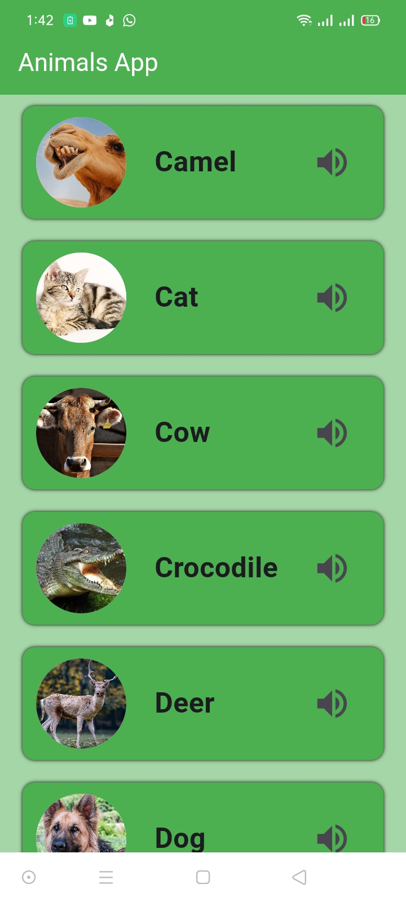
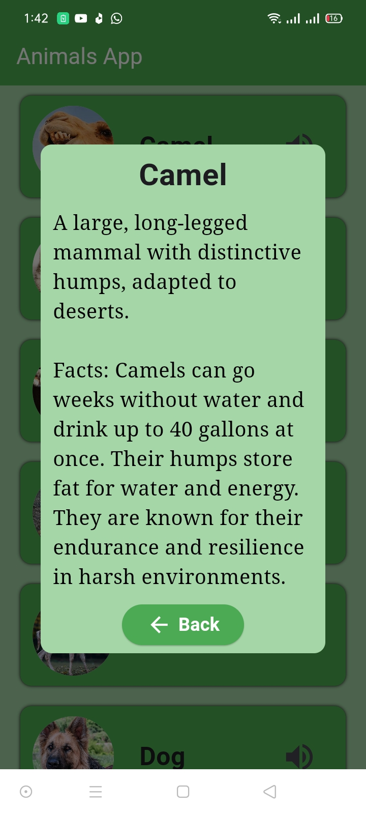

# animals app
This app allows users to explore the fascinating world of animals by listening to their unique sounds and learning interesting facts about each species. With a simple and intuitive interface, users can:

##Listen to Animal Sounds:
Enjoy high-quality audio clips of different animals, from domestic pets to wild creatures, and experience the sounds of nature like never before.
##
##Discover Fun Facts: Get detailed information about various animals, including their habitats, behavior, diet, and more.
Engage with a Wide Range of Animals: The app features a diverse collection of animals across different categories like mammals, birds, reptiles, and more.
Perfect for animal lovers, educators, and anyone curious about wildlife, this app offers an interactive way to learn while having fun.

##Screens of Application

#

